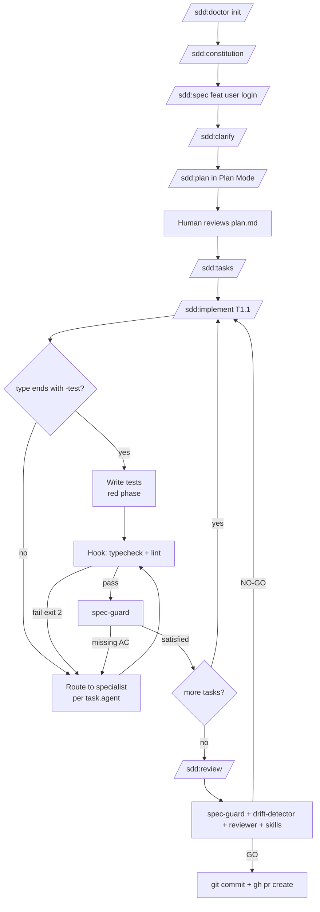

<div align="center">

# 🧩 SDD Framework for Claude Code

[](LICENSE)
[](https://claude.com/claude-code)
[](CHANGELOG.md)
[](https://github.com/JanSzewczyk/spec-driven-development/stargazers)

**Spec-Driven Development for Claude Code — spec is the source of truth, code is its consequence.**

[Features](#-features) • [Quick Start](#-quick-start) • [Architecture](#-architecture) • [Documentation](#-table-of-contents)

</div>

---

## 👋 Why SDD

Vibe coding (loose prompt → AI guesses → iterate by trial and error) works for demos but produces spaghetti in production: every fix breaks something else, security gaps multiply, the codebase becomes unmaintainable.

SDD fixes this by enforcing **canonical phases**: `constitution → spec → clarify → plan → tasks → implement → review`. AI is forced to read and confirm a plan before writing a single line of code. Verification agents and blocking hooks make the feedback loop tight enough that the model **cannot skip** validation steps.

> SDD inverts traditional AI-assisted coding. Instead of "vibe coding" (vague prompt → AI guesses → fix loop), the **specification is the source of truth** and code is its mechanical consequence.

This framework is the synthesis of:

- GitHub Spec Kit (canonical phases)
- BMAD Method (sharding, role-based sub-agents)
- Amazon Kiro (hooks, Mermaid generation)
- OpenSpec (lightweight CLI for legacy code)
- Custom Claude Code workflows (slash commands, plan mode, custom agents)

The unique contribution of this framework: **per-task routing to your existing specialist sub-agents** (storybook-tester, nextjs-backend-engineer, testing-strategist, etc.) so SDD orchestrates your stack instead of duplicating it.

---

## ✨ Features

- 📋 **Canonical SDD phases**: `constitution → spec → clarify → plan → tasks → implement → review`
- 🏥 **`/sdd:doctor`** — preflight audit + one-command init
- 🎭 **Orchestration of existing sub-agents** (does not duplicate — invokes specialist agents from the plugin marketplace via the Task tool)
- 🏷️ **Tagged tasks** — every task in `tasks.md` has `type`, `agent`, `skills` → auto-routing to the right specialist
- 🪝 **Auto-feedback hooks** — typecheck + lint block Claude via exit code 2
- 🌿 **Conventional Commits branches** — `/sdd:spec feat user login` → branch `feat/user-login`
- 📐 **TDD-first** — tests always before implementation
- 🧠 **Context discipline** — sub-agents receive only their scope, skills load on demand
- 🔍 **Drift detection** — built-in `drift-detector` and `/sdd:analyze` keep spec, plan, tasks, and code consistent

---

## 📖 Table of Contents

- [👋 Why SDD](#-why-sdd)
- [✨ Features](#-features)
- [🚀 Quick Start](#-quick-start)
- [🔄 The SDD Flow](#-the-sdd-flow)
- [🏗️ Architecture](#-architecture)
  - [🧱 Three-tier agent hierarchy](#-three-tier-agent-hierarchy)
  - [🏷️ Per-task routing](#-per-task-routing)
  - [🧠 Context management](#-context-management)
  - [🪝 Verification hooks](#-verification-hooks)
  - [📇 Capabilities registry — hybrid mode](#-capabilities-registry--hybrid-mode)
- [⌨️ Slash Commands Reference](#-slash-commands-reference)
- [🤖 Sub-agents Reference](#-sub-agents-reference)
- [📋 End-to-end Example](#-end-to-end-example)
- [📁 File Structure](#-file-structure)
- [⭐ Best Practices](#-best-practices)
- [🚫 Anti-patterns](#-anti-patterns)
- [🧩 Design Decisions](#-design-decisions)
- [🔧 Troubleshooting](#-troubleshooting)
- [🤝 Contributing](#-contributing)
- [📝 Changelog](#-changelog)
- [📜 License](#-license)
- [🙏 Acknowledgments](#-acknowledgments)
- [📧 Contact & Support](#-contact--support)

---

## 🚀 Quick Start

### 1. Install the plugin (one-time, per machine)

```bash
claude plugin install https://github.com/JanSzewczyk/spec-driven-development
```

Then enable it in your user settings (`~/.claude/settings.json`):

```json
{
  "enabledPlugins": {
    "sdd@janszewczyk": true
  }
}
```

(Depending on your Claude Code version, the `claude plugin install` command may handle this for you.)

Verify the install:

```bash
claude plugin list | grep sdd
```

You should see `sdd@0.2.0`. Once installed, the plugin's 9 slash commands, 4 verification sub-agents, and the `doctor` skill are available in **every** project — no per-project copy required.

### 2. Initialize a project

Open the target project in Claude Code and run:

```text
/sdd:doctor init      # copies CLAUDE.md.template, specs/template.md, capabilities.md, settings.json
/sdd:doctor check     # confirms 11/11 — plugin + per-project files present, constitution valid
/sdd:constitution         # edit CLAUDE.md — must be <2,500 tokens
```

What `init` does:

- Copies `CLAUDE.md` and `specs/template.md` into the project (skips if already present — never overwrites).
- Generates `.claude/capabilities.md` by scanning your installed plugin marketplace (so it reflects the specialist agents and skills you actually have).
- Generates `.claude/settings.json` with PostToolUse hooks pointing at the plugin's own `hooks/typecheck.py` and `hooks/lint.sh`.

### 3. Build your first feature

```text
/sdd:spec feat user can reset password via email
/sdd:clarify
/sdd:plan                 # run in Plan Mode (Shift+Tab)
/sdd:tasks
/sdd:implement T1.1
...
/sdd:review
```

### Forking the plugin for your own organization

If you want a customized copy (e.g. with org-specific routing rules in `capabilities.md.template`):

1. Fork this repo to your GitHub org and update the `homepage` field in `plugin.json`.
2. (Optional) Edit `skills/doctor/templates/capabilities.md.template` to pre-populate task-type routing for your stack.
3. (Optional) Edit `skills/doctor/templates/constitution.md.template` to seed your standard "WHAT NOT TO DO" rules and rationale, and `skills/doctor/templates/CLAUDE.md.template` to customize the session loader.
4. Bump the `version` in `plugin.json` and tag a release.
5. Users install your fork with `claude plugin install https://github.com/<your-org>/sdd-plugin`.

---

## 🔄 The SDD Flow



| Phase | Command | What happens |
|-------|---------|--------------|
| **Constitution** | `/sdd:constitution` | Edit `specs/constitution.md` — the long-form source of truth (tech stack, conventions, **WHAT NOT TO DO** with rationale, testing philosophy, out-of-scope). `CLAUDE.md` at the root is a separate condensed session loader, kept independent. |
| **Specify** | `/sdd:spec <type> <description>` | Validate clean git, create branch `<type>/<slug>`, generate `specs/<slug>/spec.md` (business only — no code) |
| **Clarify** | `/sdd:clarify` | AI reads spec.md and asks 5-10 targeted gap questions; updates spec with answers |
| **Plan** | `/sdd:plan` | Generate `plan.md` with Mermaid diagrams, data model, API surface, file-by-file change list. **Run in Plan Mode.** |
| **Tasks** | `/sdd:tasks` | Decompose plan into YAML tasks with `type`, `agent`, `skills` auto-routed via `capabilities.md` |
| **Implement** | `/sdd:implement <task-id>` | TDD loop + delegation to specialist agent per `task.agent`; hooks enforce typecheck + lint |
| **Review** | `/sdd:review` | spec-guard + drift-detector + reviewer + domain skills → verdict GO/NO-GO → commit + PR |
| **Analyze** | `/sdd:analyze` | Diagnostic — find drift between spec ↔ plan ↔ tasks ↔ code (run anytime) |

---

## 🏗️ Architecture

### 🧱 Three-tier agent hierarchy

```text
┌─────────────────────────────────────────────────────────────┐
│  ORCHESTRATOR (main Claude session)                         │
│  • Reads CLAUDE.md, capabilities.md, spec/sdd:plan/sdd:tasks        │
│  • Routes work to specialist agents via Task tool           │
│  • Runs verification agents at review time                  │
└─────────────────────────────────────────────────────────────┘
              ↓ Task tool                  ↓ Task tool
┌───────────────────────────┐  ┌──────────────────────────────┐
│  SPECIALIST AGENTS         │  │  VERIFICATION AGENTS         │
│  (plugin-based, YOUR stack)│  │  (generic SDD, 4 agents)     │
│  • storybook-tester         │  │  • spec-guard            │
│  • nextjs-backend-engineer  │  │  • drift-detector        │
│  • testing-strategist       │  │  • reviewer              │
│  • (other from marketplace) │  │  • ui-critic             │
└───────────────────────────┘  └──────────────────────────────┘
              ↓ "Use skill: X"
┌─────────────────────────────────────────────────────────────┐
│  SKILLS (in-context references, loaded on demand)           │
│  • @szum-tech/server-actions, design-system, ...            │
│  • react-doctor, accessibility-audit                        │
│  • find-skills (dynamic discovery)                          │
└─────────────────────────────────────────────────────────────┘
```

This framework adds:

- 1 skill (`doctor`)
- 9 slash commands (`/sdd:doctor`, `/sdd:constitution`, `/sdd:spec`, `/sdd:clarify`, `/sdd:plan`, `/sdd:tasks`, `/sdd:implement`, `/sdd:review`, `/sdd:analyze`)
- 4 verification agents (`spec-guard`, `drift-detector`, `reviewer`, `ui-critic`)
- 2 hooks (`typecheck.py`, `lint.sh`)

All **specialist agents and skills already exist** in the plugin marketplace — SDD orchestrates them, it does not duplicate them.

### 🏷️ Per-task routing

Every task in `tasks.md` carries a YAML block:

```yaml
- id: T1.2
  type: ui-component-test
  agent: storybook-tester
  skills: [storybook-testing, design-system]
  acceptance: play function asserts form validation
  files: [LoginForm.stories.tsx]
```

When the user runs `/sdd:implement T1.2`:

1. **Orchestrator** parses `tasks.md`, locates T1.2.
2. **Load skills**: emits `Use skill: storybook-testing`, `Use skill: design-system`.
3. **Delegate**: invokes the `Task` tool with `subagent_type: storybook-tester`. The prompt contains only:
   - The relevant `spec.md` section (Summary + AC + Edge cases)
   - The relevant fragment of `plan.md` (for this task only)
   - Acceptance criteria
4. **Specialist** (storybook-tester) writes the story + interaction test.
5. **Hook** PostToolUse runs typecheck + lint after every Write.
6. **Spec-guard** verifies the diff satisfies the AC.
7. **Status** in `tasks.md`: `draft` → `in-progress` → `review`.

### 🧠 Context management

Three techniques prevent context bloat:

1. **Per-task delegation** — specialists receive only their scope (spec + plan sections, never the whole feature)
2. **Skills on-demand** — `Use skill: X` only loads when needed
3. **Fresh chat per Story** — open a new Claude session between stories; `tasks.md` status is the handover document

`CLAUDE.md` token limit: **<2,500 tokens**. When you exceed it, shard per module:

- `CLAUDE.md` (root, cross-cutting concerns)
- `apps/web/CLAUDE.md` (frontend-specific)
- `apps/api/CLAUDE.md` (backend-specific)
- `packages/ui/CLAUDE.md` (component library)

### 🪝 Verification hooks

PostToolUse hooks in `.claude/settings.json` run after every `Edit`/`Write`/`MultiEdit`:

- `typecheck.py` — runs `tsc --noEmit` for TypeScript or `mypy --strict` for Python on the modified file
- `lint.sh` — runs ESLint for JS/TS or Ruff for Python

If typecheck or lint fails, the hook exits with code **2**. Claude receives the stderr output and is **forced to fix the issue** before taking the next action. There is no way to "forget" about validation.

### 📇 Capabilities registry — hybrid mode

`.claude/capabilities.md` has two kinds of sections:

- **`<!-- auto-generated -->`** — overwritten by `/sdd:doctor init` on every run (it scans `~/.claude/plugins/cache/`)
- **`<!-- user-override -->`** — preserved untouched, the safe place to keep customizations

This lets you re-run `init` (e.g., after installing a new plugin) without losing your custom task-type routing rules.

Example schema:

```markdown
## Specialist agents (delegate implementation work)
<!-- auto-generated -->
- **storybook-tester** (szum-tech) — Storybook stories + interaction tests
- **nextjs-backend-engineer** (szum-tech) — Server Actions, route handlers
- **testing-strategist** (szum-tech) — test strategy planning

## Skills (load into context on demand)
<!-- auto-generated -->
- `@szum-tech/server-actions` — Server Action patterns
- `@szum-tech/design-system` — components, design tokens, OKLCH palette
- ...

## Stack profile
<!-- auto-generated -->
- framework: nextjs
- language: typescript
- tests: vitest, playwright

## Task type → routing rules
<!-- user-override -->
| Task type           | Specialist agent          | Skills to load                          |
|---------------------|---------------------------|-----------------------------------------|
| ui-component-test   | storybook-tester          | storybook-testing, design-system        |
| server-action       | nextjs-backend-engineer   | server-actions, error-handling          |
| ...                 | ...                       | ...                                     |
```

---

## ⌨️ Slash Commands Reference

### 🏥 `/sdd:doctor [check|init|fix <ids>]`

Preflight audit and auto-setup. **11 checks**: CLAUDE.md loader (with constitution pointer), specs/template.md, plugin installed, plugin enabled, capabilities.md valid, settings.json hooks, git + gh, tooling, specialist agents discoverable, project type detected, specs/constitution.md valid.

- `check` (default) — report only, statuses ✅/⚠️/❌
- `init` — generate all missing files + auto-detect plugins → fill `capabilities.md` + adjust hooks to detected stack
- `fix <N>` — repair specific check by ID

### 📜 `/sdd:constitution`

Edit `specs/constitution.md` — the long-form project constitution (no token limit). This is the source of truth where every "WHAT NOT TO DO" rule carries its rationale, every architectural decision its trade-off. `CLAUDE.md` at the project root is a separate, independent session loader — this command does NOT modify it. If the constitution file is missing, the command directs the user to run `/sdd:doctor init` first (which bootstraps it, migrating from any existing CLAUDE.md content).

### 🌿 `/sdd:spec <type> <description>`

Phase 1 — Specify. Requires `<type>` ∈ {`feat`, `fix`, `chore`, `refactor`, `docs`} (Conventional Commits).

Steps:

1. Verify clean git tree (`git status --porcelain`) — STOP if dirty
2. Parse `<type>` and generate `feature_slug` (kebab-case) and `feature_title` (Title Case)
3. Create branch `<type>/<feature_slug>`
4. Generate `specs/<feature_slug>/spec.md` from `_template.md`

⛔ The spec file is **business-only** — no code, no tech stack details.

### ❓ `/sdd:clarify`

Phase 2 — Clarify. AI reads the current spec.md and asks 5-10 targeted questions about gaps (ambiguous requirements, missing edge cases, vague acceptance criteria). When the user answers, the spec is updated automatically.

### 🗺️ `/sdd:plan`

Phase 3 — Plan. **Run in Plan Mode** (Shift+Tab) so Claude has edits disabled and can only read/analyze.

Generates `plan.md` with:

- High-level approach
- Data model (Mermaid ER diagram)
- Component diagram (Mermaid flowchart)
- API surface table
- File-by-file change list
- Reused utilities (citing existing code paths)
- Risks & mitigations

After generation, **human review of plan.md is mandatory** before proceeding to `/sdd:tasks`.

### 🧩 `/sdd:tasks`

Phase 4 — Tasks. Decompose `plan.md` into a tagged task list:

```yaml
- id: T<story>.<n>
  title: <one-line description>
  type: <matches capabilities.md task type>
  agent: <specialist agent OR orchestrator>
  skills: [<skills to load>]
  status: draft
  acceptance: <measurable AC from spec.md>
  files: [<files to create or modify>]
```

**TDD discipline depends on the task family:**

- **Logic tasks** (server actions, route handlers, hooks, utilities): classic strict TDD — the first task in each Story is a failing unit test, then implementation.
- **UI components** (React/Next.js): **contract-first TDD in 3 tasks per component** — strict TDD fails for components because a test importing a non-existent component breaks with "Module not found" (not a meaningful red phase). The 3-task decomposition is:
  1. `ui-contract` — define the inline TypeScript props interface and a skeleton component returning `<div data-testid="..." />`. **Props live inline in the `.tsx` file — never as a separate `.types.ts`.**
  2. `ui-component-test` — import the component (no module-not-found), write tests + Storybook story that fail with **meaningful assertion errors**.
  3. `ui-component` — flesh out the skeleton until tests pass.

`/sdd:tasks` auto-emits 3 tasks per component without you asking.

### 🔨 `/sdd:implement <task-id>`

Phase 5 — Implement one task. Pipeline:

1. Mark task `in-progress`
2. **Phase validation** — depends on `type`:
   - **Logic tasks**: if not a test task, require the sibling test task with `status: review|done`.
   - **UI tasks** (contract-first TDD chain): `ui-component-test` requires sibling `ui-contract` done; `ui-component` (full impl) requires sibling `ui-component-test` done.
   - On missing prerequisite → STOP, instruct user to run `/sdd:implement <prerequisite-id>` first.
3. Load skills from `task.skills`
4. If `task.agent ≠ orchestrator` → delegate via `Task` tool with `subagent_type: <task.agent>`, passing only the relevant spec + plan slice
5. Hooks run automatically (typecheck + lint, exit 2 on failure)
6. `spec-guard` verifies the diff satisfies the task's acceptance criteria
7. Mark task `review`

⛔ One task per `/sdd:implement` invocation. Bulk implementation defeats the purpose.

### 🔍 `/sdd:review`

Phase 6 — Final audit before PR. Runs in sequence:

1. Full test suite
2. `spec-guard` over the entire feature diff
3. `drift-detector` over spec ↔ plan ↔ tasks ↔ code
4. `reviewer` agent invokes domain skills (`react-doctor`, `accessibility-audit`, etc.) based on the diff
5. Generates `specs/<slug>/review.md` with verdict GO / NO-GO
6. On GO: `git commit` (Conventional Commits format) + `gh pr create` with body linking to `spec.md`
7. On NO-GO: list concrete blockers

### 📊 `/sdd:analyze`

Diagnostic tool — run anytime to detect drift between spec ↔ plan ↔ tasks ↔ code. Useful before `/sdd:review` to avoid a NO-GO verdict.

Outputs a markdown matrix:

- ✅ **Aligned** items (spec AC → plan → task → commits)
- ⚠️ **Drift** items (with file paths and suggested fixes)
- 🔴 **Critical** conflicts (spec says X, code does contradictory Y)

⛔ Read-only — never edits files.

---

## 🤖 Sub-agents Reference

This framework introduces **only 4 new generic agents**. Everything else is your existing plugin specialists, invoked via `Task` tool with `subagent_type`.

### 🛡️ `spec-guard`

**Purpose:** Verify that a code diff satisfies all Acceptance Criteria from `spec.md` and does not introduce out-of-scope changes.

**Called by:** `/sdd:implement` (per task) and `/sdd:review` (whole feature).

**Output:** JSON

```json
{
  "satisfied": true | false,
  "ac_satisfied": ["AC1", "AC2"],
  "ac_missing": [
    {"id": "AC3", "description": "...", "reason": "no implementation in diff"}
  ],
  "out_of_scope": [
    {"file": "src/Header.tsx", "summary": "logo change unrelated to auth flow"}
  ],
  "non_goal_violations": []
}
```

Strict constraints: **never** writes code, **never** suggests fixes (only reports gaps), **never** judges code quality (that's `reviewer`'s job).

### 🔀 `drift-detector`

**Purpose:** Find inconsistencies between documentation layers (`spec.md`, `plan.md`, `tasks.md`) and the current code state.

**Called by:** `/sdd:review` and `/sdd:analyze`.

Cross-checks performed:

- **Spec → Plan**: every AC has a corresponding entry in plan.md
- **Plan → Tasks**: every file in plan.md's "File-by-file" list has a covering task
- **Tasks → Code**: tasks marked `done`/`review` actually changed their declared `files`
- **Spec → Code**: AC coverage in test files; `TODO`/`FIXME` in code matches Open Questions in spec

**Output:** Markdown report with severity tiers (✅ Aligned / ⚠️ Drift / 🔴 Critical) and a suggested fix per drift item.

### 🧐 `reviewer`

**Purpose:** Final quality audit before PR. Orchestrates domain-specific audits and decides GO/NO-GO.

**Called by:** `/sdd:review`.

Pipeline:

1. Run full test suite (command from CLAUDE.md)
2. Check coverage thresholds
3. Invoke relevant skills + agents based on the diff:
   - `react-doctor` skill if `.tsx`/`.jsx` files changed
   - `accessibility-audit` skill if UI components touched
   - `ui-critic` sub-agent if UI files in diff (visual review via browser MCP — see below)
   - `@szum-tech/server-actions` skill if server actions added
4. Verify commit messages follow Conventional Commits
5. Generate `specs/<slug>/review.md` with verdict
6. Block GO if any test fails or any critical a11y/security violation exists

**Output:** JSON `{verdict: "GO" | "NO_GO", blockers: [...], warnings: [...]}`

### 🎨 `ui-critic`

**Purpose:** Visual review of changed UI components — captures Storybook screenshots via a browser MCP and evaluates them for design-system adherence, layout regressions, and rendering issues.

**Called by:** `reviewer` (transitively from `/sdd:review`) when the diff contains `.tsx`/`.stories.tsx` files.

**Requirements:** A browser MCP server connected (e.g. `Claude_in_Chrome`, `Claude_Preview`, or Playwright MCP) plus a running Storybook (default `http://localhost:6006`). If either is missing, the agent returns verdict `SKIPPED` and the review continues without blocking.

**Output:** JSON

```json
{
  "verdict": "OK" | "WARNINGS" | "ISSUES" | "SKIPPED",
  "skip_reason": "no_mcp | storybook_unreachable | null",
  "components_reviewed": ["LoginForm", "Header"],
  "findings": [
    {
      "component": "LoginForm",
      "severity": "issue",
      "category": "design-system",
      "detail": "Submit button uses raw #3B82F6 — should use --color-primary-500",
      "screenshot": "./.sdd-screenshots/LoginForm.png"
    }
  ]
}
```

Severity classification: `issue` (visible bug, blocks GO), `warning` (suboptimal but functional), `info` (observation). `SKIPPED` never blocks `/sdd:review` — it surfaces an infrastructure note instead.

Screenshots are saved under `./.sdd-screenshots/` — add this path to `.gitignore`.

---

## 📋 End-to-end Example

Feature: **"User can reset password via email"**.

### Install + initialize

Install the plugin once per machine, then in any project:

```bash
cd ~/Projects/my-app && git init
```

In Claude Code:

```text
/sdd:doctor init       # auto-detects Next.js 15 + TS + Vitest + Storybook
/sdd:doctor check      # ✅ READY (11/11)
/sdd:constitution      # fill specs/constitution.md: Tech stack, Run/build, WHAT NOT TO DO with rationale
```

### Spec phase

```text
/sdd:spec feat user can reset password via email
```

Effects:

- ✅ Clean git verified
- ✅ Branch `feat/user-can-reset-password-via-email` created
- ✅ `specs/user-can-reset-password-via-email/spec.md` generated

You open the spec, fill in:

- User stories (Reset via email, optional MFA)
- Acceptance criteria (AC1: token valid for 1h, AC2: rate-limited to 3 attempts, …)
- Edge cases (unknown email — silent success per security best practice)

### Clarify

```text
/sdd:clarify
```

Claude asks:

1. **AC1**: should expired tokens return 410 or 401?
2. **AC2**: is the rate limit per IP, per email, or both?
3. **Edge case**: what if SMTP delivery fails — retry or fail loud?
4. ...

You answer in chat. Spec is updated.

### Plan

Enable Plan Mode (Shift+Tab):

```text
/sdd:plan
```

Generates `specs/.../plan.md`:

- Data model (Mermaid ER): `User`, `PasswordResetToken`
- Component diagram (Mermaid): `ResetForm → Action → Service → DB + Mailer`
- API surface: `POST /actions/resetPassword`
- File-by-file change list (8 files)
- Reused: `packages/errors/AuthError`, `packages/db/prismaClient`

**Read plan.md manually**, correct anything wrong.

### Tasks

```text
/sdd:tasks
```

Generates tasks (note the contract-first 3-task decomposition for the UI component):

```yaml
# Story S1: UI — ResetPasswordForm (contract-first TDD, 3 tasks)

- id: T1.1
  title: ResetPasswordForm contract + skeleton
  type: ui-contract
  agent: orchestrator
  skills: [design-system]
  status: draft
  acceptance: |
    Inline TypeScript props interface defined in ResetPasswordForm.tsx.
    Component exports a skeleton returning <div data-testid="reset-password-form" />.
  files: [apps/web/src/components/ResetPasswordForm.tsx]

- id: T1.2
  title: ResetPasswordForm tests + story
  type: ui-component-test
  agent: storybook-tester
  skills: [storybook-testing, design-system]
  status: draft
  acceptance: |
    Tests import the component (no module-not-found).
    Assertions fail with meaningful errors.
    Storybook story renders skeleton.
  files:
    - apps/web/src/components/__tests__/ResetPasswordForm.test.tsx
    - apps/web/src/components/ResetPasswordForm.stories.tsx

- id: T1.3
  title: ResetPasswordForm implementation
  type: ui-component
  agent: orchestrator
  skills: [design-system]
  status: draft
  acceptance: All tests from T1.2 pass. spec AC1 satisfied.
  files: [apps/web/src/components/ResetPasswordForm.tsx]

# Story S2: backend logic — classic strict TDD (2 tasks)

- id: T2.1
  title: Tests for resetPassword server action
  type: unit-test
  agent: orchestrator
  skills: [unit-testing]
  status: draft
  acceptance: failing tests covering spec AC2 + AC3
  files: [apps/web/src/app/actions/__tests__/resetPassword.test.ts]

- id: T2.2
  title: resetPassword server action
  type: server-action
  agent: nextjs-backend-engineer
  skills: [server-actions, error-handling, t3-env-validation]
  status: draft
  acceptance: spec AC2, AC3 — all tests from T2.1 pass
  files: [apps/web/src/app/actions/resetPassword.ts]
```

### Implement

```text
/sdd:implement T1.1
```

`type: ui-contract` (orchestrator). Defines the inline `ResetPasswordFormProps` interface and a skeleton component (`<div data-testid="reset-password-form" />`) — no logic yet. Hook validates typecheck/lint.

```text
/sdd:implement T1.2
```

`type: ui-component-test` (`agent: storybook-tester`). Prerequisite `T1.1` is done, so tests CAN import the component meaningfully. Specialist writes tests + Storybook story. Tests fail with meaningful assertion errors (not module-not-found).

```text
/sdd:implement T1.3
```

`type: ui-component` (orchestrator). Prerequisite `T1.2` is done. Orchestrator fleshes out the skeleton until all tests from T1.2 pass. `spec-guard` confirms diff matches spec AC.

```text
/sdd:implement T2.1
```

Classic strict TDD test task — orchestrator writes failing tests (red phase), confirms proper failure reasons.

```text
/sdd:implement T2.2
```

`agent: nextjs-backend-engineer` — Task tool with `subagent_type: nextjs-backend-engineer`. Specialist implements the server action with proper validation, error handling, and env-var validation per loaded skills.

### Review

```text
/sdd:review
```

Pipeline executes:

1. Tests: 23/23 passed
2. `spec-guard`: all 4 AC satisfied
3. `drift-detector`: no drift
4. `reviewer`: orchestrates skills + visual review
   - `react-doctor` skill: 89/100
   - `accessibility-audit` skill: 0 critical
   - `ui-critic` sub-agent: verdict `OK` — screenshots saved to `.sdd-screenshots/` (or `SKIPPED` if no browser MCP / Storybook available)
   - Conventions: OK
5. Verdict: **GO**
6. Commit: `feat(reset-password): add email-based reset flow`
7. PR opened with body referencing `specs/user-can-reset-password-via-email/spec.md`

### Typical timeline

| Step | Time |
|------|------|
| `/sdd:doctor init` | 30 s |
| `/sdd:spec` | 1 min (Claude generates, you edit business spec) |
| `/sdd:clarify` × 2 | 5 min (Q&A) |
| `/sdd:plan` (Plan Mode) | 3 min (analysis + generation) |
| Human review of plan.md | 5-10 min |
| `/sdd:tasks` | 1 min |
| `/sdd:implement` × 8-15 tasks | 1-3 h (most of the time here) |
| `/sdd:review` | 5 min |
| **Total** | **~2-4 h** for a medium feature |

Without SDD a similar feature is 4-6 h with frequent rework. With SDD: 2-4 h, deterministic.

---

## 📁 File Structure

### In your project (after `/sdd:doctor init`)

Only per-project artifacts. Commands / agents / verification skills live in the installed plugin, not in your project.

```text
your-project/
├── CLAUDE.md                              # session loader (<2,500 tokens); points to specs/constitution.md
├── specs/
│   ├── constitution.md                   # full project constitution (source of truth, no token limit)
│   ├── _template.md                       # base template for new specs
│   └── <feature-slug>/
│       ├── spec.md                        # business specification
│       ├── plan.md                        # architecture + Mermaid diagrams
│       ├── tasks.md                       # YAML task list with routing tags
│       └── review.md                      # generated by /sdd:review
├── .claude/
│   ├── capabilities.md                    # hybrid: auto-generated + user-overrides
│   └── settings.json                      # PostToolUse hooks → plugin hook scripts
├── apps/web/CLAUDE.md                     # (optional) module-scoped loader
└── apps/api/CLAUDE.md                     # (optional) module-scoped loader
```

### In the plugin (installed once per machine)

```text
spec-driven-development/                    # or your own forked plugin path
├── plugin.json                            # manifest
├── README.md / LICENSE / CHANGELOG.md / CONTRIBUTING.md / .github/
├── skills/
│   └── doctor/
│       ├── SKILL.md                       # skill metadata + instructions
│       ├── check.py                       # 11-point readiness check
│       ├── init.py                        # bootstraps / migrates per-project files
│       └── templates/                     # bundled templates copied by `init`
│           ├── constitution.md.template  # long-form constitution (with MIGRATED markers)
│           ├── CLAUDE.md.template         # condensed session loader
│           ├── capabilities.md.template
│           ├── settings.json.template     # ${PLUGIN_ROOT} placeholder
│           └── specs/template.md
├── commands/                              # 9 slash commands (auto-discovered)
│   ├── doctor.md
│   ├── constitution.md / spec.md / clarify.md / plan.md
│   ├── tasks.md / implement.md / review.md / analyze.md
├── agents/                                # 4 verification sub-agents
│   ├── spec-guard.md
│   ├── drift-detector.md
│   ├── reviewer.md
│   └── ui-critic.md                   # optional — needs browser MCP
└── hooks/
    ├── typecheck.py                       # exit 2 = blocks Claude
    └── lint.sh
```

---

## ⭐ Best Practices

Eleven actionable rules drawn from the source materials (Spec Kit, BMAD, Kiro, OpenSpec, Anthropic guidance):

1. **🧪 Force AI to validate its own work.** Every task's `acceptance` field must be measurable. Hooks make typecheck/lint non-skippable. For **logic** (server actions, hooks, utilities) use classic strict TDD — failing test first, then implementation. For **UI components** use contract-first TDD: define inline props interface + skeleton component, then tests + Storybook story (which now fail with meaningful assertion errors, not module-not-found), then full implementation. Props interface lives inline in the `.tsx` file — never as a separate `.types.ts`.
2. **📜 Constitution carries the WHY, CLAUDE.md carries the operational surface.** Every "WHAT NOT TO DO" rule in `specs/constitution.md` should have a `**Why:**` line (and an incident reference when applicable). `CLAUDE.md` summarizes the top operational rules and links back to the constitution. After every Claude mistake, append the lesson — with its rationale — to the constitution. Without rationale, rules become folklore and get re-broken.
3. **✂️ Shard large specs.** Never hand a giant PRD to an implementer agent. Break it into Epic → Story → Task. Each specialist receives only its slice.
4. **📁 Separate `CLAUDE.md` per module.** Root for cross-cutting, `apps/web/CLAUDE.md` for frontend, `apps/api/CLAUDE.md` for backend. Frontend code shouldn't burn tokens reading database rules.
5. **🔒 Use Plan Mode before edits.** `/sdd:plan` and `/sdd:clarify` ideally run in Plan Mode (Shift+Tab) so Claude cannot accidentally modify files during exploration.
6. **👤 Human-in-the-loop on `plan.md`.** Always read the generated plan before `/sdd:tasks`. This is the cheapest moment to correct course.
7. **🌿 One branch per feature.** `/sdd:spec` enforces it. Conventional Commits naming (`feat/...`, `fix/...`).
8. **🤝 Use sub-agents for large reads.** Don't grep 50 files in the main session — invoke a `Task` tool sub-agent and receive only a summary.
9. **🔄 Keep spec ↔ code in sync.** When you change code manually, update the spec. Use `/sdd:analyze` to detect drift periodically.
10. **💬 Fresh chat per Story.** Open a new Claude session when switching to a new Story. `tasks.md` status is your handover document.
11. **❓ Embrace the Clarify phase.** Letting AI ask questions before planning surfaces gaps that would otherwise burn implementation cycles.

---

## 🚫 Anti-patterns

What to avoid — common failure modes when adopting SDD:

- ❌ **Skipping `/sdd:clarify`** "because I know what I want." Open questions almost always surface real gaps.
- ❌ **Skipping human review of `plan.md`.** Claude can hallucinate architecture, especially on unusual stacks.
- ❌ **Multiple `/sdd:implement` calls in one chat.** Context bloats, hallucinations rise. One task per session is the ideal.
- ❌ **Manual `git commit` instead of `/sdd:review`.** You bypass `spec-guard` / `drift-detector` / `reviewer`.
- ❌ **Code or tech details in `spec.md`.** The spec is a business document. Implementation belongs in plan.md and code.
- ❌ **Bloated `CLAUDE.md`.** Above ~2,500 tokens, Claude starts ignoring the bottom. Shard per module.
- ❌ **`--dangerously-skip-permissions` in production.** A hallucinated bash command can destroy your system.
- ❌ **Implementing without a spec.** SDD only works if every feature has its `specs/<slug>/spec.md` first.

---

## 🧩 Design Decisions

Why this framework looks the way it does:

| Decision | Rationale |
|----------|-----------|
| **Per-project, not global** | Different projects have different stacks, different specialist agents, different routing rules. A global framework would force homogeneity. |
| **Only 4 new agents** | The rest already exists in the plugin marketplace (storybook-tester, nextjs-backend-engineer, …). Duplicating them would be wasted effort and version drift. |
| **YAML tags in tasks.md** | Explicit > heuristic. The user knows exactly which agent will be invoked for each task. |
| **Conventional Commits in `/sdd:spec`** | Branch names and commit messages aligned with industry standard. Compatible with semantic-release, changeset, etc. |
| **Hook exit code 2** | The strongest possible feedback signal for Claude. Cannot be ignored or skipped — Claude must fix the failure before continuing. |
| **Skills loaded on demand** | No global pre-loading means smaller context per task. Skills are referenced from `capabilities.md` and loaded only when the task type requires them. |
| **Plan Mode before `/sdd:implement`** | Forces human review and blocks destructive changes before a plan exists. |
| **Hybrid capabilities.md** | `<!-- auto-generated -->` sections reflect installed plugins. `<!-- user-override -->` sections preserve customizations. Re-running `init` is safe. |
| **CLAUDE.md at root, not in .claude/** | Claude Code reads `CLAUDE.md` from the project root by default. Putting it in `.claude/` would require manual loading. |
| **Framework lives in the plugin, project owns its specs** | Commands, agents, hooks, and the doctor skill ship with the plugin (installed once per machine). The project keeps only what is genuinely project-specific: `CLAUDE.md`, `specs/`, `capabilities.md`, `settings.json`. Plugin updates roll out by reinstalling; project data is never overwritten. |

---

## 🔧 Troubleshooting

| Symptom | Likely cause | Fix |
|---------|--------------|-----|
| `/sdd:doctor check` shows ❌ on check #9 (specialist agents) | No plugins installed | Install relevant plugins (e.g., `@szum-tech` marketplace) and re-run `/sdd:doctor init` |
| Hooks not firing after Edit | `settings.json` not loaded | Verify `.claude/settings.json` exists and `chmod +x .claude/hooks/*` |
| `/sdd:spec` fails with "uncommitted changes" | Working tree dirty | `git stash` or commit current changes first |
| `/sdd:implement` keeps producing the same code despite hook failures | typecheck error not propagating | Check that `typecheck.py` exits with code 2 on failure; verify `tsc`/`mypy` is installed |
| `/sdd:tasks` produces tasks with `agent: orchestrator` for everything | `capabilities.md` routing rules don't match task descriptions | Edit the `<!-- user-override -->` routing rules section in `capabilities.md` |
| `spec-guard` always returns `satisfied: true` even for incomplete code | Acceptance criteria in spec.md are too vague | Rewrite AC to be measurable (`input X → output Y`) |
| Plan Mode disabled but `/sdd:plan` still works | Plan Mode is recommended but not required | For correctness this is fine; for safety enable Plan Mode (Shift+Tab) |
| New specialist agent installed but not appearing in `capabilities.md` | `init` not re-run | `/sdd:doctor init` to rescan plugins |

---

## 🤝 Contributing

Contributions are welcome! See [CONTRIBUTING.md](CONTRIBUTING.md) for the development setup, the local smoke-test loop, style guidelines, and the PR checklist.

In short:

1. Fork the repository and create a feature branch (`git checkout -b feat/new-skill`)
2. Make changes inside the plugin (`commands/`, `agents/`, `skills/`, `hooks/`, `skills/doctor/templates/`)
3. Run the smoke test (`check.py` then `init.py` against a fresh empty directory)
4. Update the README's File Structure / reference sections and add a `CHANGELOG.md` entry under `[Unreleased]`
5. Open a Pull Request

---

## 📝 Changelog

See [CHANGELOG.md](CHANGELOG.md) for the full version history. This project follows [Keep a Changelog](https://keepachangelog.com/en/1.1.0/) and [Semantic Versioning](https://semver.org/spec/v2.0.0.html).

---

## 📜 License

This project is licensed under the **MIT License**. See the [LICENSE](LICENSE) file for details. © 2026 Jan Szewczyk.

---

## 🙏 Acknowledgments

SDD is a synthesis of ideas from the spec-driven and agentic-coding ecosystem:

- [GitHub Spec Kit](https://github.com/github/spec-kit) — canonical phases
- BMAD Method — sharding and role-based sub-agents
- Amazon Kiro — hooks and Mermaid generation
- OpenSpec — lightweight CLI for legacy code
- [Anthropic Claude Code](https://claude.com/claude-code) — slash commands, plan mode, custom agents, and the plugin system this framework is built on

---

## 📧 Contact & Support

- 🐛 [Open an issue](https://github.com/JanSzewczyk/spec-driven-development/issues)
- ⭐ [Star this repository](https://github.com/JanSzewczyk/spec-driven-development)
- 👨‍💻 Check out the maintainer's [GitHub profile](https://github.com/JanSzewczyk)

---

<div align="center">

**Made with ❤️ by [Jan Szewczyk](https://github.com/JanSzewczyk)**

If this framework helped you, please consider giving it a ⭐ on GitHub!

[⬆ Back to Top](#-sdd-framework-for-claude-code)

</div>
