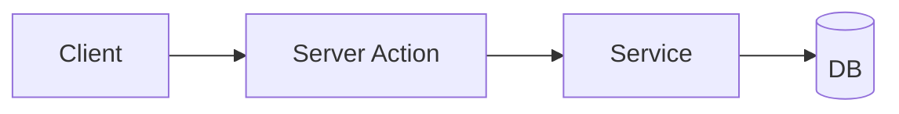

The **Plan** phase of SDD. Generate an architecture document `plan.md`. **DO NOT write code.**

> ⚠️ Recommended to run this command in **Plan Mode** (Shift+Tab in Claude Code) — that way
> Claude has file edits disabled and can only read + plan.
>
> 💰 **Recommended session model: Opus** — architecture is judgement-heavy and this is the cheapest
> moment to get it right (a bad plan multiplies cost downstream).

## Steps

### 1. Load context

- `CLAUDE.md` (project constitution)
- `specs/capabilities.md` (specialist agents + skills + routing rules)
- `specs/<current>/spec.md` (from the current branch OR from `$ARGUMENTS`)

### 2. Survey the existing codebase

Use the **Task tool** (sub-agent of type `Explore`) to scan the current codebase for:
- Architectural patterns (folder structure, naming conventions)
- Existing utilities / services that can be reused
- TypeScript/Python/etc. conventions

The sub-agent returns **only a summary** — saving main-session tokens.

### 2a. Design source — extract once, cache the style spec

If `spec.md` references a design source (a Figma link in its "Links" section, or another design
tool exposed via an MCP server), extract it **once, inside a Task sub-agent** — pull only the
metadata and targeted screenshots you need, parse them in the sub-agent, and have it return a
**distilled style spec** (tokens, spacing, typography, component-to-code mapping). Write that
distilled spec into `plan.md` (see the "Design reference" section below) so downstream phases
(`/sdd:tasks`, `/sdd:implement`, `ui-critic`) read the cache instead of re-pulling the large MCP
output into the main context. Never pull raw design-tool output into the main session.

If there is no design source, skip this step.

### 3. Generate `plan.md`

Save to `specs/<current>/plan.md`. Structure:

```markdown
# Plan: <feature_title>

**Spec:** `specs/<slug>/spec.md`
**Status:** draft

## High-level approach
<1-2 paragraphs — what we are building, from a bird's-eye view>

## Data model

```mermaid
erDiagram
    User ||--o{ Session : has
    User { ... }
```

## Component diagram



## API surface
| Endpoint | Method | Input | Output | Auth |
|----------|--------|-------|--------|------|
| ... | ... | ... | ... | ... |

## File-by-file change list
- `apps/web/src/components/LoginForm.tsx` — new component
- `apps/api/src/auth/signIn.ts` — new server action
- `apps/api/src/auth/__tests__/signIn.test.ts` — new test
- ...

## Reused utilities
- `packages/errors/AuthError` (from `packages/errors/src/auth.ts`)
- `packages/db/prismaClient` (from `packages/db/src/client.ts`)

## Design reference
<!-- Only when a design source exists — the distilled style spec cached from Step 2a.
     Omit this section entirely if there is no Figma/design source. -->
- Tokens / spacing / typography: ...
- Component-to-code mapping: <Figma component> → `<code component>`
- Source: <Figma link> (extracted once; do not re-pull)

## Risks & mitigations
- **Risk**: rate limit on external API
  **Mitigation**: exponential backoff in `packages/http/retry.ts`

## Open questions for human review
- ?
```

### 4. Advance status + STOP for human review

Set `specs/<current>/spec.md` header `**Status:**` → `planned` (unless already at a later state).
`plan.md` is created with `**Status:** draft`.

Show the user:
- ✅ Plan saved to: `specs/<slug>/plan.md`
- 👉 READ the plan and edit manually before continuing
- Next step: `/clear`, then `/sdd:tasks` (it re-reads `plan.md` + `capabilities.md` from disk, so
  clearing the transcript first starts the next phase from a small context and loses nothing)

## Constraints

- ⛔ DO NOT create files other than `plan.md` (just this one)
- ⛔ DO NOT write actual implementation code
- ⛔ DO NOT invoke specialist agents — that is done by `/sdd:implement`
- ✅ ALWAYS produce at least 2 Mermaid diagrams (data + component)
